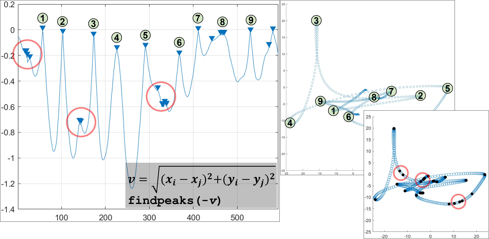
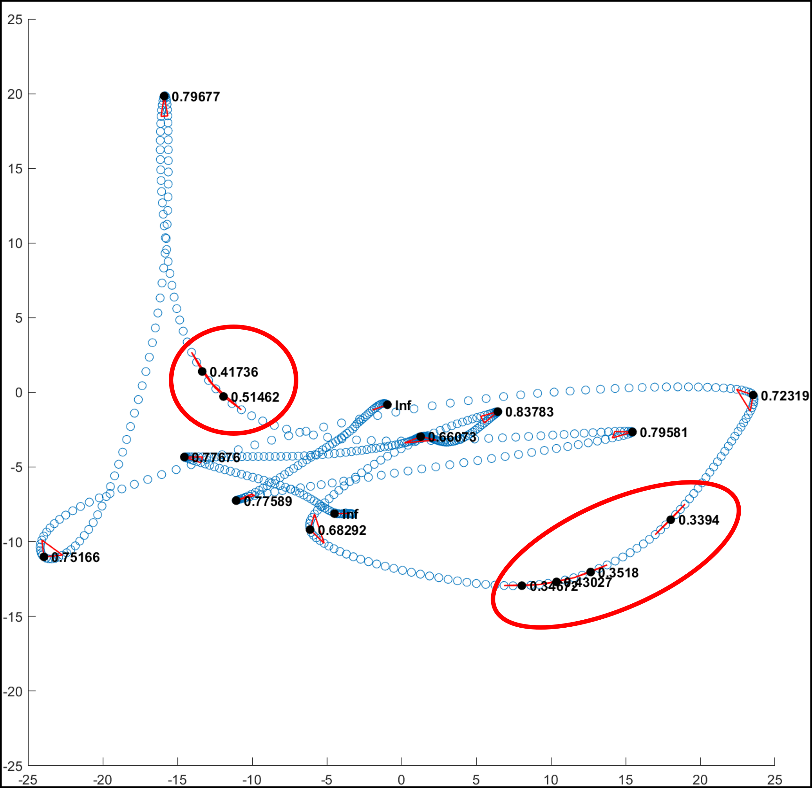

# Movement Segmentation

An algorithm that identifies meaningful changes or pauses in head movement. Written using Matlab. Data is head rotation recorded using a Vive Pro Eye VR Headset.

## Overview

Left shows the original rotation data.  
Middle shows the potential segments in the data (coloured lines).  
Right shows the segments identified by the algorithm.

## Peak Analysis

Segments are identified using a peak analysis on the head velocity at each data point.  
However, some peaks are false positives and so need to be filtered out.

## Threshold Filter

One method is to use a simple threshold filter and say that certain characteristics under a threshold indicate a true or false segment.  
For example, sharp angles are a strong indication of sudden changes in head movement.

## Performance Filter

Another method would be to use a probablistic approach, where each characteristic contributes to an overall p-value.  
Then if this p-value is significant, the peak can be considered a true positive.  
  
Alternatively, cluster analysis, like k-means can be used to determine true positives.

